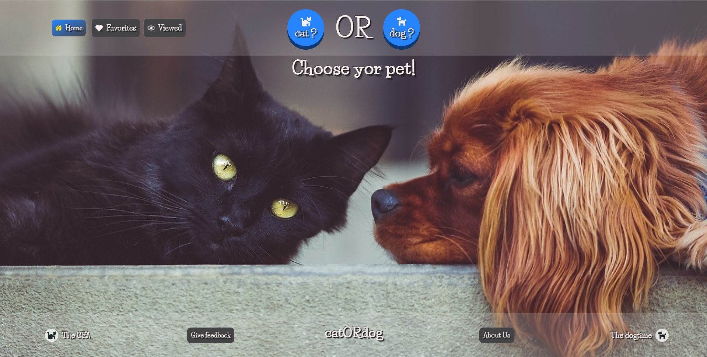
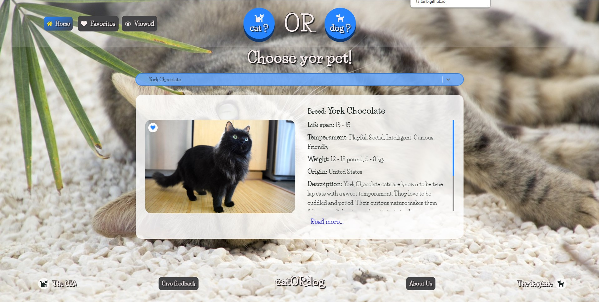
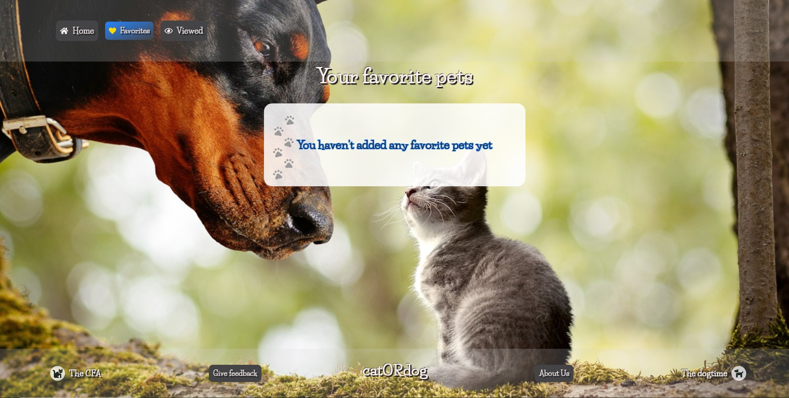
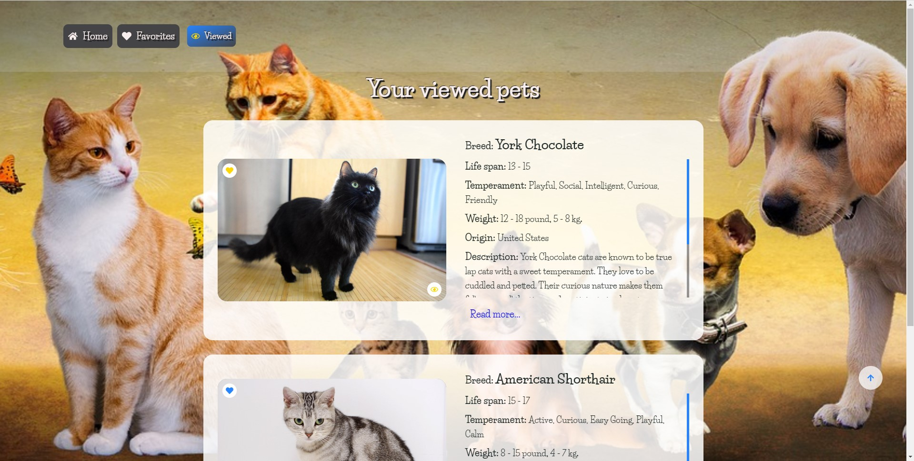

<h1> catORdog?</h1>

<b style="font-size: 20px;">catORdog</b> - is a landing page for pet fanciers. Desktop version.

<h2>This project was created using:</h2>
<ul>
<li>HTML</li>
<li>SCSS</li>
<li>React</li>
</ul>

<ul>
<li>axios</li>
<li>formik</li>
<li>react-icons</li>
<li>react-loader-spinner</li>
<li>react-router-dom</li>
<li>react-select</li>
<li>styled-components</li>
</ul>

